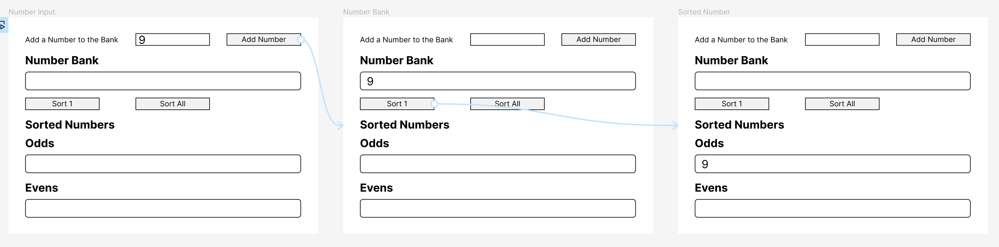

# Workshop - Odds and Events

In this workshop, you'll continue to get more practice working with events and event handlers. The goal is to create an app that allows a user to enter a number which gets placed into a numbecr bank. The user can then sort the numbers in the bank into one of two categories: odd or even.

## Submission

Please submit a link to your Github repo..

REQUIREMENTS:
*When the user clicks the "Add Number" button, the number they entered into the input field should be added to the number bank.

*The number bank is not changed if the user enters a non-numeric value.

*The number bank should display all the numbers the user has entered.

*When the "Sort 1" button is clicked, the first number in the number bank should be removed and placed into either the odd or even category.

*When the "Sort All" button is clicked, all the numbers in the number bank should be moved into either the odd or even category.

*The numbers are placed into the correct bucket based on whether they are odd or even.